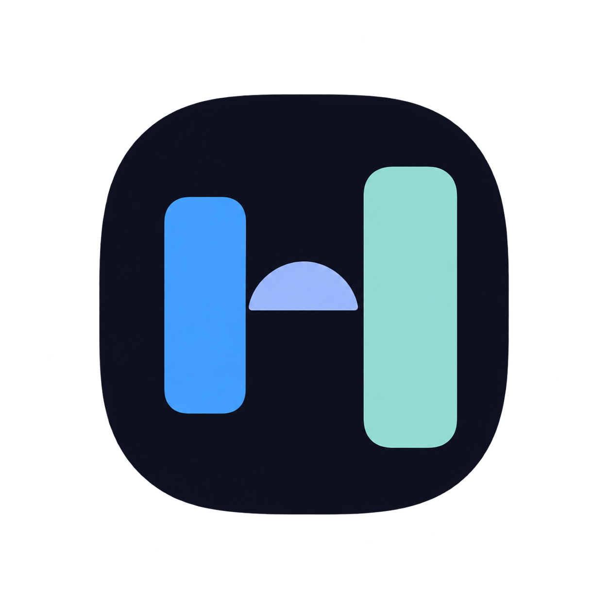
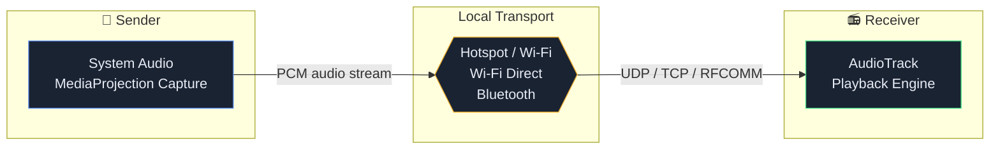
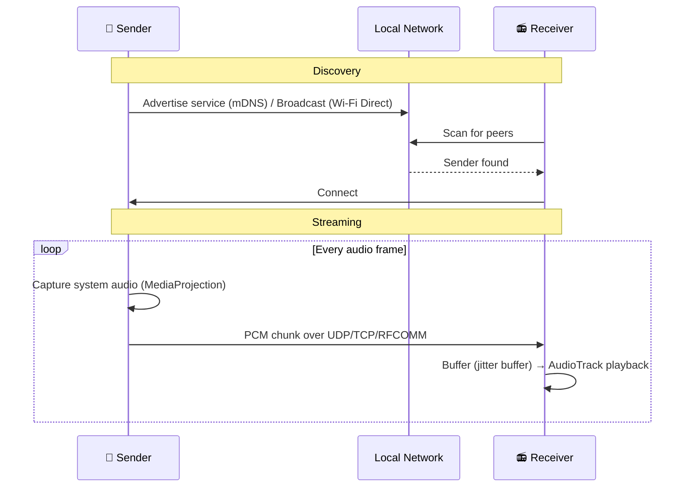
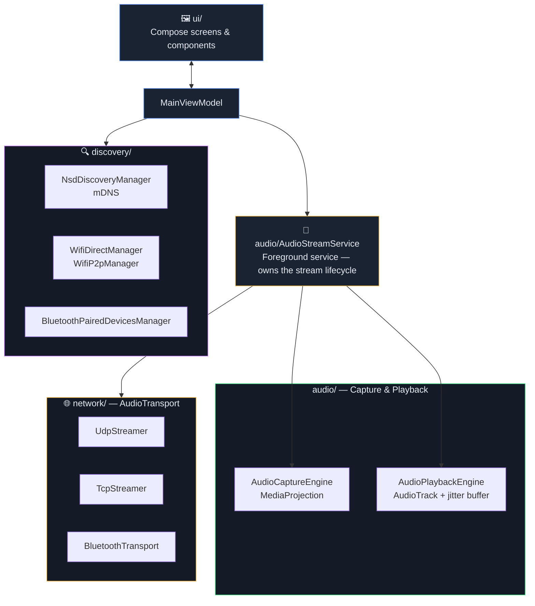

<div align="center">



# AudioBridge

**Stream system audio between Android devices over your local network — no cloud, no accounts, no internet.**

[](https://github.com/VoxNode-ux/Audio-Stream/actions/workflows/build.yml)
[](https://github.com/VoxNode-ux/Audio-Stream/actions/workflows/codeql.yml)
[](https://github.com/VoxNode-ux/Audio-Stream/actions/workflows/dependency-security-scan.yml)
[](LICENSE)
[](#requirements)
[](https://kotlinlang.org)

</div>

---

AudioBridge turns any two Android devices into a wireless audio link. Play something on your phone and hear it on your tablet — over a Wi-Fi hotspot, Wi-Fi Direct, or Bluetooth — with no third-party server ever in the loop.

<div align="center">



</div>

## Table of Contents

- [Features](#features)
- [How it works](#how-it-works)
- [Screenshots](#screenshots)
- [Architecture](#architecture)
- [Permissions](#permissions)
- [Getting started](#getting-started)
- [Building from source](#building-from-source)
- [Project structure](#project-structure)
- [CI / CD](#ci--cd)
- [Requirements](#requirements)
- [Roadmap](#roadmap)
- [Contributing](#contributing)
- [License](#license)

## Features

| | |
|---|---|
| 🔊 **System audio capture** | Streams whatever's playing on the sender — music, video, games — not just the microphone |
| 🌐 **Three transports** | Hotspot/Wi-Fi (mDNS auto-discovery), Wi-Fi Direct (no router needed), or Bluetooth (paired devices) |
| ⚡ **UDP or TCP** | Lowest latency, or guaranteed delivery — your choice per session |
| 🎚️ **Configurable quality** | 16-bit/44.1kHz up to 32-bit/48kHz uncompressed PCM |
| 🧵 **Adjustable jitter buffer** | Trade latency for smoothness depending on link quality |
| 📊 **Live stream stats** | Real-time latency, jitter, packets sent/received, packets lost |
| 🔁 **Auto-reconnect** | Reconnects to the last device automatically on launch |
| 🕶️ **Private by design** | No ads, no analytics, no accounts, no internet permission beyond the local link itself |
| 🆓 **100% free & open source** | Apache 2.0 licensed, no proprietary dependencies |

## How it works

One device is the **Sender** (captures and streams audio out); the other is the **Receiver** (listens and plays audio back). Pick a role on each device, pick a transport, find the other device, and start streaming.

<div align="center">



</div>

### Hotspot / Wi-Fi mode
Turn on a mobile hotspot on one device and connect the other to it, then tap **Scan for Device** on both — they discover each other automatically over mDNS.

### Wi-Fi Direct mode
No hotspot setup required. Scan for nearby peers directly and connect device-to-device.

### Bluetooth mode
Pair the two devices in Android's Bluetooth settings first — AudioBridge picks from already-paired devices rather than scanning for new ones.

## Screenshots

<div align="center">
<table>
<tr>
<td align="center"><b>Setup</b></td>
<td align="center"><b>Discovery</b></td>
<td align="center"><b>Streaming</b></td>
</tr>
<tr>
<td></td>
<td></td>
<td></td>
</tr>
</table>
</div>

> Add your own screenshots to `.github/assets/` using the filenames above — see [Contributing](#contributing).

## Architecture

AudioBridge is a single-module Android app built with Kotlin and Jetpack Compose. Audio capture, network transport, and discovery are cleanly separated so each transport is a self-contained implementation of a shared interface.

<div align="center">



</div>

Every transport (`UdpStreamer`, `TcpStreamer`, `BluetoothTransport`) implements the same `AudioTransport` interface (`connect()`, `send()`, `listen()`, `close()`), so `AudioStreamService` drives all three identically regardless of which link is active underneath.

## Permissions

AudioBridge requests only what each active feature needs — nothing is requested up front for features you don't use.

| Permission | Why it's needed |
|---|---|
| `RECORD_AUDIO` | Required by Android's `AudioRecord`/`AudioPlaybackCaptureConfiguration` API surface even though actual consent for system audio capture comes from the MediaProjection screen-capture dialog, not a mic prompt. Sender role only. |
| `NEARBY_WIFI_DEVICES` (API 33+) / `ACCESS_FINE_LOCATION` + `ACCESS_COARSE_LOCATION` (API 29–32) | Required by Android for Wi-Fi Direct peer discovery |
| `BLUETOOTH_CONNECT` / `BLUETOOTH_SCAN` (API 31+) or legacy `BLUETOOTH` / `BLUETOOTH_ADMIN` (API 29–30) | Bluetooth pairing and streaming |
| `POST_NOTIFICATIONS` | Shows the ongoing foreground-service notification while streaming |
| `FOREGROUND_SERVICE`, `FOREGROUND_SERVICE_MEDIA_PLAYBACK`, `FOREGROUND_SERVICE_MEDIA_PROJECTION` | Keeps the stream alive reliably while the app is backgrounded |
| `INTERNET`, `ACCESS_NETWORK_STATE`, `ACCESS_WIFI_STATE`, `CHANGE_WIFI_STATE`, `ACCESS_WIFI_MULTICAST_STATE`, `CHANGE_WIFI_MULTICAST_STATE` | Local socket networking and mDNS discovery — traffic never leaves your local network |
| `WAKE_LOCK` | Keeps the CPU/network awake mid-stream so a weak hotspot signal doesn't drop the connection |

**No location data is ever collected, stored, or transmitted.** The location-adjacent permissions above exist solely because Android ties Wi-Fi Direct peer discovery to them at the platform level — AudioBridge never reads or uses actual location.

## Getting started

1. Install AudioBridge on both devices (see [Building from source](#building-from-source), or grab a release once published to F-Droid/GitHub Releases)
2. On the device that should play audio, set role to **Receiver**
3. On the device whose audio you want to stream, set role to **Sender**
4. Pick a transport on both — Hotspot/Wi-Fi, Wi-Fi Direct, or Bluetooth — and match the setup steps for that mode above
5. Scan, connect, and tap **Start Sending** / **Start Receiving**

## Building from source

**Requirements:** JDK 21, Android SDK (`compileSdk 37`, `minSdk 29`)

```bash
git clone https://github.com/VoxNode-ux/Audio-Stream.git
cd Audio-Stream
./gradlew assembleDebug
```

The debug APK is written to `app/build/outputs/apk/debug/`.

To run lint and unit tests locally, same as CI:

```bash
./gradlew lintDebug testDebugUnitTest
```

## Project structure

```
app/src/main/java/com/audiobridge/app/
├── MainActivity.kt              # Entry point, permission requests
├── MainViewModel.kt             # UI state, orchestrates discovery & streaming
├── audio/
│   ├── AudioCaptureEngine.kt    # MediaProjection-based system audio capture
│   ├── AudioPlaybackEngine.kt   # AudioTrack playback + jitter buffer
│   ├── AudioStreamService.kt    # Foreground service owning the stream lifecycle
│   ├── FixedFrameBuffer.kt      # Fixed-size PCM frame buffering
│   └── PcmCompressor.kt         # PCM compression for bandwidth-constrained links
├── discovery/
│   ├── NsdDiscoveryManager.kt              # mDNS discovery (Hotspot/Wi-Fi)
│   ├── WifiDirectManager.kt                # WifiP2pManager wrapper
│   └── BluetoothPairedDevicesManager.kt    # Paired-device lookup
├── network/
│   ├── AudioTransport.kt    # Shared transport interface
│   ├── UdpStreamer.kt       # UDP sender/receiver
│   ├── TcpStreamer.kt       # TCP sender/receiver
│   └── BluetoothTransport.kt# RFCOMM sender/receiver
├── ui/
│   ├── MainScreen.kt        # Main Compose screen
│   ├── Components.kt        # Shared Compose components
│   └── theme/                # Material3 theme
└── util/
    ├── NetworkUtils.kt      # Network/IP helpers
    ├── PreferencesManager.kt# DataStore-backed settings persistence
    └── StreamModels.kt      # Shared data classes (StreamStats, config, etc.)
```

## CI / CD

Every push and pull request runs through:

| Workflow | Purpose |
|---|---|
| **Build** | `lintDebug`, `testDebugUnitTest`, `assembleDebug` — the app must lint clean and build successfully |
| **CodeQL** | Static analysis for security vulnerabilities in the Kotlin/Java source |
| **Trivy Security Scan** | Scans all dependencies (including transitive ones) and the container/filesystem for known CVEs |
| **Dependency Review** | Flags newly introduced vulnerable dependencies on pull requests |
| **Dependency Submission** | Keeps GitHub's dependency graph accurate for Gradle's dynamic resolution |
| **Secret Scanning** | Catches accidentally committed credentials |

Dependency updates are managed by **Dependabot** with grouped security updates enabled.

## Requirements

- Android 10 (API 29) or newer
- Two Android devices to stream between
- For Hotspot/Wi-Fi or Wi-Fi Direct: both devices' Wi-Fi radios on (no internet access required — everything stays local)
- For Bluetooth: devices paired in Android Settings first

## Roadmap

- [ ] F-Droid release
- [ ] Multi-receiver broadcast (one sender, many receivers)
- [ ] Reduce debug/release APK size further via resource shrinking tuning
- [ ] In-app latency auto-tuning based on live packet loss

Have an idea? Open an [issue](https://github.com/VoxNode-ux/Audio-Stream/issues).

## Contributing

Issues and pull requests are welcome.

- Keep the project dependency-free of proprietary SDKs, trackers, or analytics — this is a hard requirement, not a preference, and PRs introducing any will not be accepted
- Run `./gradlew lintDebug testDebugUnitTest` locally before opening a PR
- Screenshots for the README go in `.github/assets/` — see the placeholders in [Screenshots](#screenshots)

## License

Licensed under the [Apache License 2.0](LICENSE).

```
Copyright 2026 VoxNode-ux

Licensed under the Apache License, Version 2.0 (the "License");
you may not use this file except in compliance with the License.
You may obtain a copy of the License at

    http://www.apache.org/licenses/LICENSE-2.0

Unless required by applicable law or agreed to in writing, software
distributed under the License is distributed on an "AS IS" BASIS,
WITHOUT WARRANTIES OR CONDITIONS OF ANY KIND, either express or implied.
See the License for the specific language governing permissions and
limitations under the License.
```

---

<div align="center">
<sub>Built with Kotlin, Jetpack Compose, and no cloud in sight.</sub>
</div>
